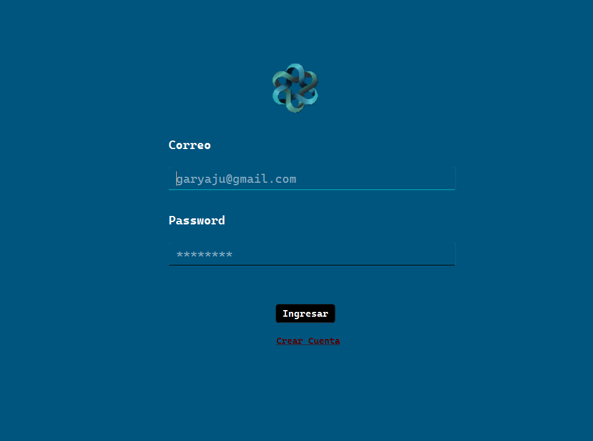
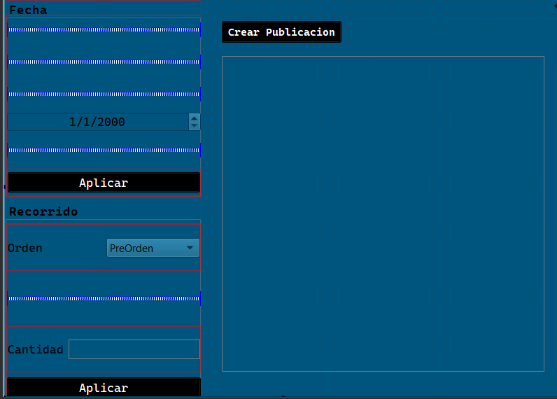
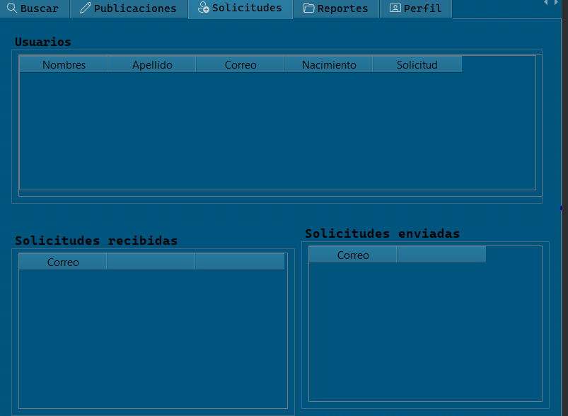
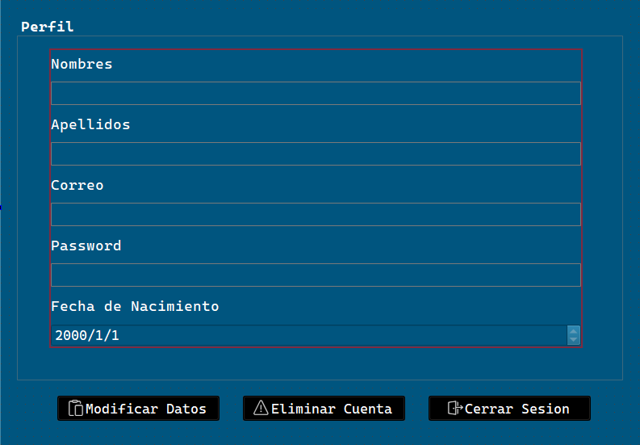
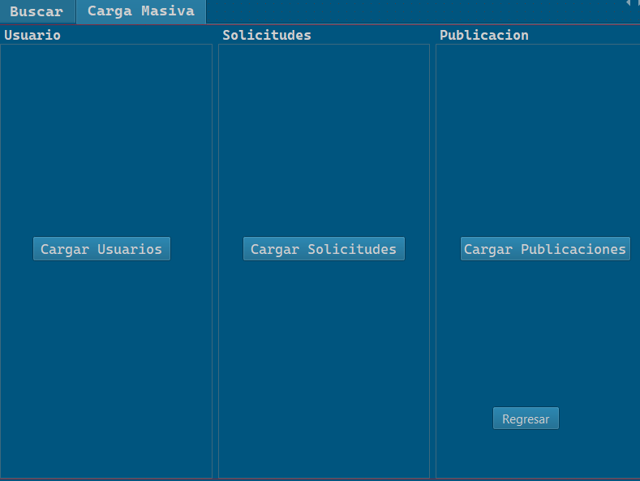

### Gary Alexander Josué Aju Chuta  
**Carnet:** 202206963  
**Facultad:** Ingeniería Ciencias y Sistemas  
**Sección:** EDD C  

---

En este proyecto, se desarrolló una red social utilizando C++. La aplicación permite a los usuarios registrarse, gestionar amistades, y compartir publicaciones. A través de una estructura de matriz, se organizan las relaciones entre los usuarios, permitiendo una eficiente administración de las interacciones y conexiones en la plataforma. El proyecto también incluye la capacidad de navegar por publicaciones y gestionar amistades, proporcionando una experiencia similar a la de una red social real, todo implementado en un entorno de consola.

## Descripción del Programa

El modulo de inicio de sesion, en donde se pondra un correo y contrasenia para verficar que existan en la aplicacion

Si es un usuario tendra la opcion de crear publicaciones y podran ser observadas por el feed;

Aqui encontrara los usuarios de la aplicacion para poder recibir solicitudes

En el administrador se podra hacer la carga masiva de los siguientes archivos